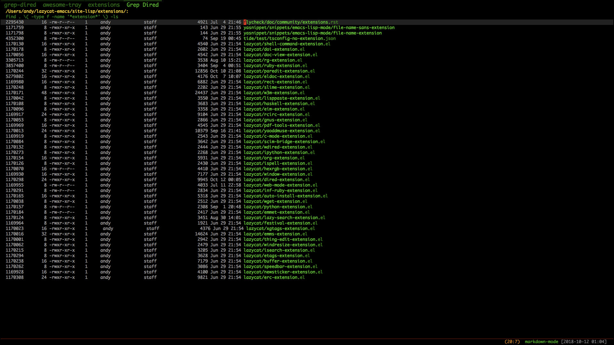

### What's this?
Find name with given regexp, and show in dired.

Then we can open file, edit file even use wdired do awesome operation!!!

## Installation
Then put grep-dired.el to your load-path.

The load-path is usually ~/elisp/.

It's set in your ~/.emacs like this:

```Elisp
(require 'grep-dired)
```

## Usage

Use command ```grep-dired-dwim``` search filename under current directory.

Use command ```grep-dired``` for customize search.
